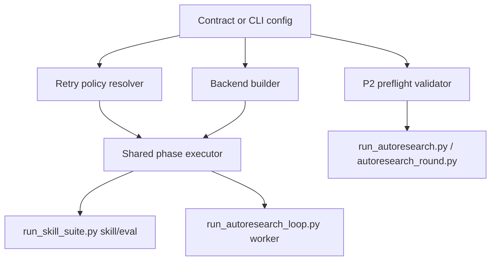

# Design Document

## Overview

This feature introduces two shared capabilities into the research runner stack:

1. A backend-neutral phase execution layer that can run `skill`, `eval`, and loop `worker` prompts against `claude`, `codex`, or `opencode`.
2. A shared retry policy that can be configured from CLI flags and autoresearch contracts and applied consistently across suite runs and loop worker runs.

The implementation keeps the existing backend adapter boundary in `toolchain/scripts/research/backends/` and moves retry/orchestration concerns into a reusable execution layer instead of duplicating subprocess logic in each runner.

## Steering Document Alignment

### Technical Standards (tech.md)

No steering docs are present. The design follows the repo's existing conventions:

- keep business logic in `toolchain/scripts/research/`
- keep contracts in fixture schema + loader code
- keep backend-specific differences inside `backends/*`
- keep runtime artifacts in `.autoworkflow/` or operator-provided save directories

### Project Structure (structure.md)

The change stays inside the existing `toolchain/scripts/research/` implementation layer plus supporting docs. No new root-level directories are introduced.

## Code Reuse Analysis

### Existing Components to Leverage

- **`toolchain/scripts/research/backends/base.py`**: already defines the shared backend invocation interface and normalized extraction boundary.
- **`toolchain/scripts/research/backends/__init__.py`**: already centralizes backend construction and is the right place to extend backend-specific CLI shaping.
- **`toolchain/scripts/research/run_skill_suite.py`**: already owns normalized `RunResult`, artifact writing, eval parsing, and summary generation.
- **`toolchain/scripts/research/run_autoresearch_loop.py`**: already owns loop orchestration and worker prompt creation; only the worker execution path is hardcoded.
- **`toolchain/scripts/research/autoresearch_contract.py`**: already owns contract parsing and is the correct place to add contract-level backend and retry fields.
- **`toolchain/scripts/research/autoresearch_round.py`**: already owns P2 suite preflight and candidate suite execution.

### Integration Points

- **Skill/eval execution**: `run_skill_suite.py` will call the shared backend executor for both phases.
- **Loop worker execution**: `run_autoresearch_loop.py` will use the same executor for `phase=worker`.
- **Autoresearch contract loading**: `autoresearch_contract.py` and `toolchain/evals/fixtures/schemas/autoresearch-contract.schema.json` will expose backend expectation and retry settings.
- **P2 preflight**: `autoresearch_round.py` will validate backend expectations from contract fields instead of hardcoding Codex-only assumptions.
- **Suite launches inside autoresearch**: `run_autoresearch.py` and `autoresearch_round.py` will forward resolved retry settings into nested `run_skill_suite.py` invocations.

## Architecture

The new architecture keeps one execution pipeline shape:



### Modular Design Principles

- **Single File Responsibility**: backend adapters build commands and extract final output; retry policy resolution classifies failures; runners orchestrate phase order and artifact placement.
- **Component Isolation**: worker routing will not duplicate eval parsing, timeout handling, or retry bookkeeping already needed by suite execution.
- **Service Layer Separation**: contract parsing stays separate from runtime invocation.
- **Utility Modularity**: a new shared executor module should host normalized retry and subprocess behavior.

## Components and Interfaces

### Component 1: Shared Backend Phase Executor

- **Purpose:** Run one `skill`, `eval`, or `worker` phase against a selected backend with retries and normalized outcome data.
- **Interfaces:** `run_phase(...) -> PhaseExecutionResult`
- **Dependencies:** `backends/base.py`, subprocess, retry policy config, eval parsing hooks supplied by caller
- **Reuses:** existing `BackendInvocation`, backend `extract_final_message()`, `coerce_process_output()`

Expected normalized result shape:

```text
- returncode
- timed_out
- raw_stdout
- raw_stderr
- final_message
- parse_error
- attempt_count
- attempts[]
```

### Component 2: Contract and CLI Backend/Retry Resolver

- **Purpose:** Resolve effective backend selection and retry policy from contract defaults plus CLI overrides.
- **Interfaces:** contract dataclass fields plus runner-side `resolve_*` helpers
- **Dependencies:** `autoresearch_contract.py`, runner CLI parsing
- **Reuses:** existing contract schema validation and `load_contract_for_cli()`

Planned contract additions:

```text
- worker_backend: optional, defaults to codex when omitted
- worker_model: optional
- expected_backend: optional, defaults to codex for P2 when omitted
- expected_judge_backend: optional, defaults to codex for P2 when omitted
- retry_policy:
  - max_attempts
  - backoff_seconds
  - retry_on[]
```

### Component 3: OpenCode Backend MVP

- **Purpose:** Make the existing OpenCode backend slot executable for skill and eval phases.
- **Interfaces:** `healthcheck()`, `build_skill_command()`, `build_eval_command()`, `extract_final_message()`
- **Dependencies:** OpenCode CLI transport format
- **Reuses:** existing backend registry and shared executor

MVP constraints:

- support model override
- support repo directory targeting
- support output format selection
- parse final usable text from JSON event output
- do not require schema support; eval falls back to text parsing when unavailable

### Component 4: P2 Preflight Validator

- **Purpose:** Enforce single-task/single-prompt P2 rules while making backend expectations configurable.
- **Interfaces:** `validate_p2_preflight(contract)`
- **Dependencies:** suite manifest loading, contract target resolution
- **Reuses:** current single-task and prompt-path checks

## Data Models

### RetryPolicyConfig

```text
- max_attempts: int
- backoff_seconds: int | float
- retry_on: list[str]
```

### PhaseAttemptRecord

```text
- attempt: int
- returncode: int | null
- timed_out: bool
- failure_reason: string | null
- raw_stdout_excerpt: string | null
- raw_stderr_excerpt: string | null
```

### PhaseExecutionResult

```text
- returncode: int | null
- timed_out: bool
- raw_stdout: string
- raw_stderr: string
- final_message: string
- parse_error: string | null
- attempt_count: int
- final_attempt: int
- attempts: list[PhaseAttemptRecord]
```

## Error Handling

### Error Scenarios

1. **Contract or preflight validation failure**
   - **Handling:** fail immediately before backend invocation
   - **User Impact:** command exits non-zero with a deterministic validation error

2. **Retryable backend failure**
   - **Handling:** classify the failure, sleep for configured backoff, retry until attempt budget is exhausted
   - **User Impact:** final success or failure reflects the last attempt, with all failed attempts recorded in metadata

3. **OpenCode structured schema unsupported**
   - **Handling:** skip schema transport and rely on text eval parsing
   - **User Impact:** eval still completes if rubric text is parseable

4. **Non-retryable path boundary or parameter error**
   - **Handling:** abort immediately and mark as non-retryable
   - **User Impact:** fast failure without wasting attempts

## Testing Strategy

### Unit Testing

- backend adapter tests for Claude, Codex, and new OpenCode command construction and final-message extraction
- retry classification tests for timeout, non-zero exit, empty eval output, and transient disconnect patterns
- contract parsing tests for new backend expectation and retry fields

### Integration Testing

- `run_skill_suite.py` tests for retry success on third attempt, no retry when `max_attempts=1`, and artifact metadata containing attempt history
- `run_autoresearch_loop.py` tests for configurable worker backend routing and retry bookkeeping
- `autoresearch_round.py` tests for configurable P2 preflight backend expectations

### End-to-End Testing

- deterministic smoke covering default Codex path
- deterministic smoke covering `claude -> claude` P2 preflight acceptance
- deterministic smoke covering one OpenCode skill invocation with parseable final output

## Risks and Guardrails

- Existing `max_candidate_attempts_per_round` already controls mutation-selection behavior; the new phase retry policy must remain a separate contract field to avoid semantic collisions.
- Retry metadata changes will touch `*.meta.json` and `run-summary.json`; summary schema compatibility must be reviewed during implementation.
- OpenCode CLI event payload shape may require a small adapter-specific parser; the implementation should keep that parser isolated inside `backends/opencode.py`.
