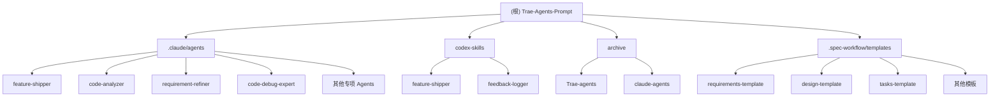

# Trae-Agents-Prompt 项目文档

## 变更记录 (Changelog)

### 2025-12-26 01:02:28
- 初次生成 AI 上下文文档
- 识别并建立模块索引
- 创建项目结构图与导航

---

## 项目愿景

本项目旨在构建一套**可闭环交付**的自动化 Agent 工作流系统，适用于 Claude Code 和 Codex（以及其他兼容宿主）。

**核心原则**：任何需求输入（对话/文档/链接）先打磨成可验证的 DoD（Definition of Done），再进入实现；以"测试全绿"为唯一门禁。

**目标用户**：
- 使用 Claude Code 的开发者，需要专业化 Agent 辅助
- 使用 Codex 的自动化工作流用户
- 希望标准化需求-开发-测试闭环的团队

---

## 架构总览

### 技术架构特征

- **语言栈**：Python 3.x（工具脚本）、Markdown（文档与模板）、Shell/PowerShell（跨平台脚本）
- **运行时要求**：Python 3.7+（推荐 3.9+）
- **跨平台支持**：Windows (PowerShell)、WSL/Ubuntu (Bash)
- **依赖管理**：无外部依赖（纯标准库实现）
- **版本控制**：Git（Gitee 托管）

### 核心设计原则

1. **文档驱动**：所有 Agent 均基于 Markdown 文档定义行为与约束
2. **跨平台一致性**：提供等价的 `.ps1` / `.sh` 脚本对，确保 Windows/Linux 行为一致
3. **可复用性**：Skills 可独立安装到 `$CODEX_HOME`，Agents 可复制到目标项目
4. **最小依赖**：避免外部依赖，所有工具脚本使用 Python 标准库
5. **增量可验证**：强制"测试全绿"作为交付门槛

---

## 模块结构图



---

## 模块索引

| 模块路径 | 类型 | 职责概述 | 关键文件 |
|---------|------|---------|---------|
| `.claude/agents/` | Claude Code Agents | 为 Claude Code 提供专业化 Agent 定义 | `feature-shipper.md`, `code-analyzer.md`, `requirement-refiner.md` |
| `codex-skills/feature-shipper/` | Codex Skill | 闭环交付核心工具（init/doctor/gate/recommend-model） | `SKILL.md`, `scripts/autoworkflow.py` |
| `codex-skills/feedback-logger/` | Codex Skill | 后台日志记录器（可选，用于改进测试与调试） | `SKILL.md`, `scripts/feedback.py` |
| `.spec-workflow/templates/` | 工作流模板 | 需求/设计/任务/技术文档模板 | `requirements-template.md`, `tasks-template.md` |
| `archive/Trae-agents/` | 归档内容 | 历史 Trae 模板（非主线维护） | `Bugfixer.md`, `CodeAnalyzer.md` 等 |
| `archive/claude-agents/` | 归档内容 | 游戏叙事相关 Agent（非软件交付主线） | `game-narrative-architect.md` |

---

## 运行与开发

### 环境要求

- Python 3.7+ (推荐 3.9+)
- Git
- Windows: PowerShell 5.1+ 或 PowerShell Core 7+
- Linux/WSL: Bash 4.0+

### 快速开始

#### A) 在目标项目中使用（推荐：repo-local）

**1. 初始化 `.autoworkflow/` 到目标项目**

```bash
# Windows (在目标项目根目录执行)
python <path-to-this-repo>\codex-skills\feature-shipper\scripts\autoworkflow.py init

# WSL/Ubuntu
python <path-to-this-repo>/codex-skills/feature-shipper/scripts/autoworkflow.py init
```

**2. 运行 doctor 检查项目可运行性**

```powershell
# Windows
powershell -ExecutionPolicy Bypass -File .autoworkflow\tools\aw.ps1 doctor --write --update-state

# WSL/Ubuntu
bash .autoworkflow/tools/aw.sh doctor --write --update-state
```

**3. 配置 gate（定义"测试全绿"）**

```powershell
# Windows
powershell -ExecutionPolicy Bypass -File .autoworkflow\tools\aw.ps1 set-gate --create --build "npm run build" --test "npm test"

# WSL/Ubuntu
bash .autoworkflow/tools/aw.sh set-gate --create --build "npm run build" --test "npm test"
```

**4. 执行 gate 验证**

```powershell
# Windows
powershell -ExecutionPolicy Bypass -File .autoworkflow\tools\aw.ps1 gate

# WSL/Ubuntu
bash .autoworkflow/tools/aw.sh gate
```

#### B) 全局安装到 Codex Skills（可选）

将 `codex-skills/*` 复制或软链接到 `$CODEX_HOME/skills/`，之后可在任何地方使用：

```bash
# 示例：复制到 Codex Skills 目录
cp -r codex-skills/feature-shipper "$CODEX_HOME/skills/"
cp -r codex-skills/feedback-logger "$CODEX_HOME/skills/"
```

#### C) 在 Claude Code 中使用 Agents

将 `.claude/agents/*.md` 复制到目标项目的 `.claude/agents/` 目录：

```bash
# 示例：复制核心 Agent
cp .claude/agents/feature-shipper.md <target-project>/.claude/agents/
cp .claude/agents/requirement-refiner.md <target-project>/.claude/agents/
```

### 常用命令速查

| 命令目标 | Windows | WSL/Ubuntu |
|---------|---------|------------|
| 初始化 autoworkflow | `python ...\autoworkflow.py init` | `python .../autoworkflow.py init` |
| 运行 doctor | `aw.ps1 doctor --write --update-state` | `aw.sh doctor --write --update-state` |
| 配置 gate | `aw.ps1 set-gate --create --build "..." --test "..."` | `aw.sh set-gate --create --build "..." --test "..."` |
| 执行 gate | `aw.ps1 gate` | `aw.sh gate` |
| 推荐模型 | `aw.ps1 recommend-model --intent doctor` | `aw.sh recommend-model --intent doctor` |
| 初始化反馈日志 | `python ...\feedback.py init` | `python .../feedback.py init` |
| 启动后台日志 | `fb.ps1 start` | `fb.sh start` |
| 停止后台日志 | `fb.ps1 stop` | `fb.sh stop` |

---

## 测试策略

### 测试哲学

本项目采用**文档即测试**的理念：
- Agent 定义本身即为行为规范，通过实际使用验证
- 工具脚本通过在真实项目中的 `doctor` 和 `gate` 运行验证
- 无传统单元测试（因为是文档和工具脚本集合）

### 验证方式

1. **工具脚本验证**
   - 在多个真实项目中运行 `init` / `doctor` / `gate`
   - 跨平台验证（Windows PowerShell + WSL Bash）
   - 验证输出是否符合预期（`.autoworkflow/state.md` 更新正确）

2. **Agent 行为验证**
   - 在 Claude Code 中加载 Agent 并执行真实任务
   - 验证是否遵循约束（例如：先打磨 spec 再实现）
   - 验证是否产生预期产物（spec.md / state.md / 代码变更）

3. **跨平台一致性验证**
   - 同一命令在 Windows/WSL 产生一致结果
   - 检查 `.ps1` 和 `.sh` 脚本的等价性

---

## 编码规范

### 文档规范

1. **Agent 定义（`.md` 格式）**
   - 必须包含 YAML front matter：`name`, `description`, `model`
   - 使用清晰的章节结构：核心原则 → 工作流程 → 输出要求
   - 约束条件使用列表形式，易于扫描

2. **模板文档**
   - 保持占位符一致性：`[描述]` 表示需要填充的内容
   - 提供足够的内联说明与示例
   - 保持 Markdown 格式规范（标题层级、代码块、列表）

### Python 脚本规范

1. **代码风格**
   - 遵循 PEP 8
   - 使用类型注解（Python 3.7+ `from __future__ import annotations`）
   - 函数与变量使用 `snake_case`

2. **结构规范**
   - 所有脚本必须包含 `argparse` CLI 接口
   - 使用 `dataclass` 定义数据结构
   - 异常处理要明确且有意义的错误信息

3. **跨平台兼容性**
   - 使用 `pathlib.Path` 而非字符串路径操作
   - 避免依赖平台特定特性
   - 提供等价的 PowerShell / Bash 包装脚本

### Shell 脚本规范

1. **PowerShell (`.ps1`)**
   - 使用 `$ErrorActionPreference = "Stop"` 严格模式
   - 参数使用 Pascal Case（如 `$BuildCmd`）
   - 使用 `Join-Path` 而非字符串拼接路径

2. **Bash (`.sh`)**
   - 使用 `set -euo pipefail` 严格模式
   - 参数使用 UPPER_SNAKE_CASE（如 `$BUILD_CMD`）
   - 使用 `$(dirname "${BASH_SOURCE[0]}")` 获取脚本目录

---

## AI 使用指引

### 针对 Claude Code 用户

**推荐 Agent 使用场景**：

1. **feature-shipper**
   - 用于：新功能开发、Bug 修复并补测试、按 spec 逐项实现
   - 特点：强制"先打磨验收标准"再实现，以"测试全绿"为门槛
   - 触发时机：需要闭环交付一个可验证的变更时

2. **requirement-refiner**
   - 用于：用户需求模糊、范围不清晰、需要收敛到 MVP
   - 特点：五阶段强制流程（澄清 → 收缩 → 步进 → 文档 → 交付）
   - 触发时机：接到宽泛需求（如"做个社交APP"）时

3. **code-analyzer**
   - 用于：分析代码结构与架构、生成架构文档
   - 特点：语言无关分析（不假设技术栈）
   - 触发时机：需要理解陌生代码库或生成架构图时

4. **code-debug-expert**
   - 用于：定位复杂 Bug、分析日志与错误栈
   - 特点：系统性调试方法（假设-验证循环）
   - 触发时机：遇到难以定位的 Bug 时

5. **system-log-analyzer**
   - 用于：分析系统日志、事故复盘
   - 特点：时序分析与根因推断
   - 触发时机：生产故障分析或性能问题排查时

### 针对 Codex 用户

**推荐 Skill 使用场景**：

1. **feature-shipper skill**
   - 核心能力：`init` / `doctor` / `set-gate` / `gate` / `recommend-model`
   - 使用时机：在任何需要闭环交付的项目中初始化 `.autoworkflow/`

2. **feedback-logger skill**
   - 核心能力：后台 watch `.autoworkflow/*` 变化并记录到 `feedback.jsonl`
   - 使用时机：需要保留调试中间信息、改进测试时

### 使用建议

1. **先 doctor，后实现**
   - 在任何改动前，先跑 `doctor` 确认项目可运行
   - 避免在"跑不起来"的状态下盲目编码

2. **强制 gate 验证**
   - 每次实现完成后，必须跑 `gate` 确认"测试全绿"
   - 不要提交未通过 gate 的代码

3. **增量保存状态**
   - 使用 `.autoworkflow/state.md` 记录当前进展
   - 避免长时间对话后状态丢失

4. **模型智能选择**
   - 轻量任务（doctor/简单实现）用中等模型（Sonnet）
   - 复杂调试/跨模块分析时用 `recommend-model --intent debug` 升级

---

## 相关资源

- **使用教程**：见 `README.md`
- **模块详情**：见各模块的 `CLAUDE.md`（如 `.claude/agents/CLAUDE.md`）
- **AI 使用指南**：`AI高效使用指南.md`
- **Git 仓库**：[Gitee: trae-agents-prompt](https://gitee.com/fdch0/trae-agents-prompt)

---

## 许可与贡献

- 本项目为开源工具集，欢迎提交 Issue 与 Pull Request
- 归档内容（`archive/`）为历史版本，不再主动维护
- 主线维护内容：`.claude/agents/`、`codex-skills/`、`.spec-workflow/templates/`
